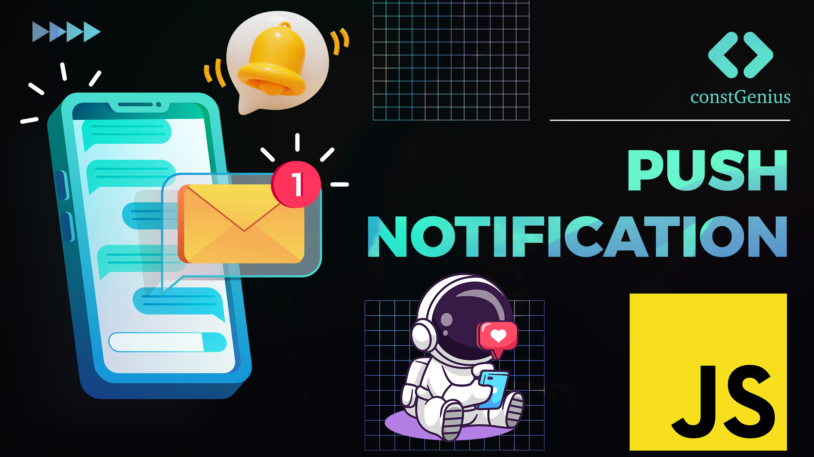

# Push Notification with JavaScript

This JavaScript project demonstrates how to implement push notifications in a web application. Push notifications are a powerful way to engage users by sending real-time updates and messages directly to their devices, even when the application is not open. In this project, we will use the Web Push API and Service Workers to achieve this functionality.

